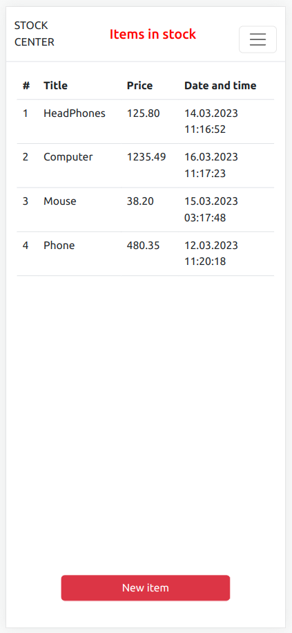

# [Items in stock](https://test-cifra-b.vercel.app/)
### Completed test task for Cifra Bank

## Stack:
- React
- TypeScript
- Hooks
- LocalStorage
- Bootstrap
- ESLint
- Prettier


## App Preview:




---

## Setup


```bash
git clone git@github.com:MikRyam/test-cifra-b.git
cd test-cifra-b

npm install
# or
yarn install
```

## Getting Started

```bash
npm run start
# or
yarn start
```

## Other available scripts

```bash
# run Prettier
npm run format

```

## Bundle application

```bash
# run build
npm run build
```

